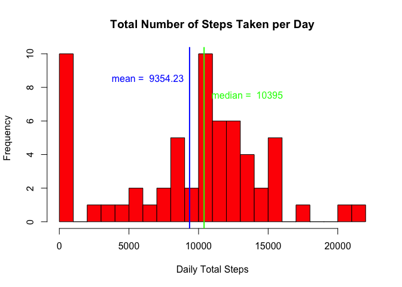
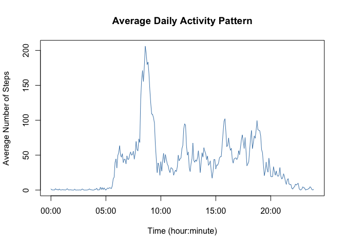
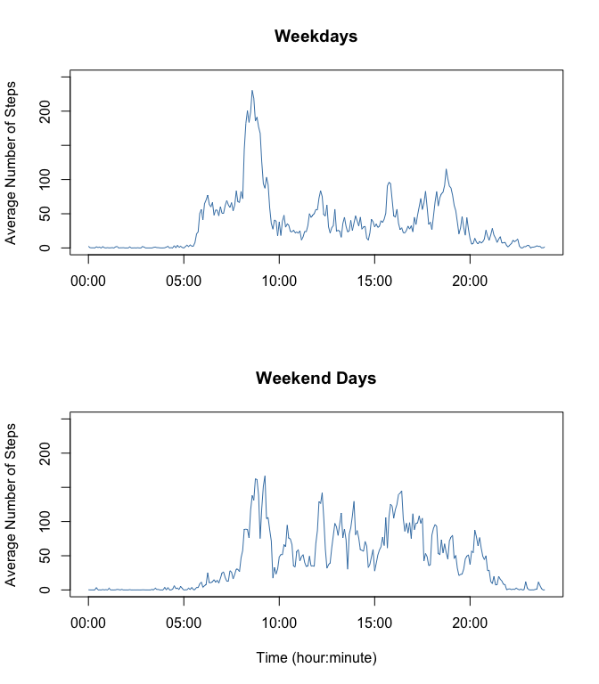

# Reproducible Research: Peer Assessment 1
Tamer Koksal  
May 17, 2015  

***

## Loading and preprocessing the data

First, let's read the "activity.csv" file in the working directory into an R-data frame and name it as "activity".


```r
# Read the data "acitivity.csv" in the working directory into an R-data frame and call it 'activity'.
activity <- read.csv("activity.csv")
```

Next, we examine the structure of the data to see whether the data needs any processing. 


```r
# Examine the structure of the data
str(activity)
```

```
## 'data.frame':	17568 obs. of  3 variables:
##  $ steps   : int  NA NA NA NA NA NA NA NA NA NA ...
##  $ date    : Factor w/ 61 levels "2012-10-01","2012-10-02",..: 1 1 1 1 1 1 1 1 1 1 ...
##  $ interval: int  0 5 10 15 20 25 30 35 40 45 ...
```

The data consists of 17,568 observations and 3 variables: namely 'steps' of integer type, 'date' of factor type, and 'interval' of integer type. It is better to convert the factor-type "date" variable into some date format. To do that we're going to make use of the package :: lubridate, which provides an elegant way for dealing with date-time type of variables.


```r
# Need to convert factor variable 'date' into a date format
library(lubridate)
activity$date <- ymd(activity$date)

# Examine the structure of the data
str(activity)
```

```
## 'data.frame':	17568 obs. of  3 variables:
##  $ steps   : int  NA NA NA NA NA NA NA NA NA NA ...
##  $ date    : POSIXct, format: "2012-10-01" "2012-10-01" ...
##  $ interval: int  0 5 10 15 20 25 30 35 40 45 ...
```

As you can see from the above output, 'date' variable has been converted to a class of POSIXct.

***

## What is mean total number of steps taken per day?

This question involves aggregating the 'activity' data frame by the variable 'date' through summing up the number of 'steps' across all time intervals in each day. The package :: dplyr provides an easy way for manipulating and grouping(aggregating) data. By using dplyr::group_by function we first group the data per day and then using the dplyr::summarize we aggregate by summing up the number of steps.


```r
library(dplyr)
```

```
## 
## Attaching package: 'dplyr'
## 
## The following objects are masked from 'package:lubridate':
## 
##     intersect, setdiff, union
## 
## The following object is masked from 'package:stats':
## 
##     filter
## 
## The following objects are masked from 'package:base':
## 
##     intersect, setdiff, setequal, union
```

```r
# Group/aggregate the 'activity' data frame by 'date'
group_by_day <- group_by(activity, date)

# Summarize the grouped data by computing the total number of steps per each day 
total_steps_perday <- summarize(group_by_day, totalsteps = sum(steps, 
                                                               na.rm = TRUE))
# Examine the data
head(total_steps_perday)
```

```
## Source: local data frame [6 x 2]
## 
##         date totalsteps
## 1 2012-10-01          0
## 2 2012-10-02        126
## 3 2012-10-03      11352
## 4 2012-10-04      12116
## 5 2012-10-05      13294
## 6 2012-10-06      15420
```

As you can see the resulting data frame "total_steps_perday" consists of 2 variables: 'date' (day) and the corresponding number of 'totalsteps'. 

Now, let's plot the histogram of daily total number of steps and compute the corresponding measures of central tendency, namely the mean and the median.


```r
with(total_steps_perday, {
    hist(totalsteps, col = "red", breaks = 17, 
         main = "Total Number of Steps Taken per Day", 
         xlab = "Daily Total Steps")
    abline(v = mean(total_steps_perday$totalsteps), lwd = 2, col = "blue")
    text(x = mean(total_steps_perday$totalsteps) - 3000, y = 8, 
         labels = paste("mean = ", format(mean(total_steps_perday$totalsteps), 
                                          nsmall = 2)), 
         col = "blue", pos = 3)
    abline(v = median(total_steps_perday$totalsteps), lwd = 2, col = "green")
    text(x = median(total_steps_perday$totalsteps) + 3100, y = 7, 
         labels=paste("median = ", format(median(total_steps_perday$totalsteps),
                                          nsmall = 2)), 
         col = "green", pos = 3)
})
```

 

```r
mean(total_steps_perday$totalsteps)
```

```
## [1] 9354.23
```

```r
median(total_steps_perday$totalsteps)
```

```
## [1] 10395
```

According to the histogram, there are 10 days out 60 (2 months) with zero daily total number of steps. In fact, these 10 days are the ones with missing data for the number of steps taken. Since missing values were disregarded during the aggregation process, the total number of steps for the days with missing data were computed as zero. The mean number of daily total steps was computed to be 9354.23. However, a more accurate representation of the central tendency of the daily total number of steps would be the median: 10395 since there are a considerable number of days with zeros which artificially pull the mean down. 

***

## What is the average daily activity pattern?

In order to calculate the average daily activity pattern, we need to compute the mean number of steps taken at each interval across all days. In other words, we need to aggregate/group by the variable 'interval'.

Let's first begin by recalling our data structure and variables.


```r
# Data structure
str(activity)
```

```
## 'data.frame':	17568 obs. of  3 variables:
##  $ steps   : int  NA NA NA NA NA NA NA NA NA NA ...
##  $ date    : POSIXct, format: "2012-10-01" "2012-10-01" ...
##  $ interval: int  0 5 10 15 20 25 30 35 40 45 ...
```

```r
# View last rows the data
tail(activity)
```

```
##       steps       date interval
## 17563    NA 2012-11-30     2330
## 17564    NA 2012-11-30     2335
## 17565    NA 2012-11-30     2340
## 17566    NA 2012-11-30     2345
## 17567    NA 2012-11-30     2350
## 17568    NA 2012-11-30     2355
```

The variable (`interval` = 0, 5, 10, 15, 20, 25, 30, 35, 40, 45, 50, 55, 100, 105...) is an integer type of variable and a sequence of 5-minutes intervals begining from 0 and ending at 23:55. The equi-distance of intervals is distorted at transitions between hours (e.g. 50, 55, 100). As an integer type, the distance between 50-55 and 55-100 is not the same. So we need to devise a method of converting the inverval variable from integer to a time-format. This can be done by first extracting the hour and minute part from the corresponding integer and then combining these two parts into a time format. Hour-part can be extracted through dividing the integer by 100 and taking the greatest integer smaller than this division. Minute-part can be extracted by computing the modulus of the integer with respect to 100 (e.g. 105 modulus 100 = 5).


```r
# Extracting the hour-part
hour <- floor(activity$interval/100)

# Extracting the minute-part
minute <- activity$interval%%100

# Combining these two parts with a ":" in between, which in turn will facilitate to time conversion
hourmin <- paste(hour, ":", minute, sep = "")

# Copy data frame into 'activity1' and create hour-minute variable of character format
activity1 <- activity
activity1$interval1 <- hourmin

# Examine the new data
head(activity1)
```

```
##   steps       date interval interval1
## 1    NA 2012-10-01        0       0:0
## 2    NA 2012-10-01        5       0:5
## 3    NA 2012-10-01       10      0:10
## 4    NA 2012-10-01       15      0:15
## 5    NA 2012-10-01       20      0:20
## 6    NA 2012-10-01       25      0:25
```

```r
str(activity1)
```

```
## 'data.frame':	17568 obs. of  4 variables:
##  $ steps    : int  NA NA NA NA NA NA NA NA NA NA ...
##  $ date     : POSIXct, format: "2012-10-01" "2012-10-01" ...
##  $ interval : int  0 5 10 15 20 25 30 35 40 45 ...
##  $ interval1: chr  "0:0" "0:5" "0:10" "0:15" ...
```

To be able to plot the daily activity pattern, first we need to aggregate by the interval variable.


```r
# Aggregate by interval and assign the resulting data frame into 'activity2'
activity2 <- aggregate(activity1, by = list(activity1$interval1), 
                       FUN = mean, na.rm = TRUE)

# Examine 'activity2'
str(activity2)
```

```
## 'data.frame':	288 obs. of  5 variables:
##  $ Group.1  : chr  "0:0" "0:10" "0:15" "0:20" ...
##  $ steps    : num  1.717 0.1321 0.1509 0.0755 2.0943 ...
##  $ date     : POSIXct, format: "2012-10-31 02:00:00" "2012-10-31 02:00:00" ...
##  $ interval : num  0 10 15 20 25 30 35 40 45 5 ...
##  $ interval1: num  NA NA NA NA NA NA NA NA NA NA ...
```

After aggregating, the resulting data frame has 288 observation, which is the number of 5-minute interval points in a day. The resulting 'Group.1' variable
is nothing but the hour-minute character type variable created previously. So, we're going to use this variable to recode it into a time format


```r
# Recode the interval variable into a time format and assign it to 'interval2'
activity2$interval1 <- activity2$Group.1
activity2$interval2 <- as.POSIXct(activity2$interval1, format = "%H:%M")

# Sort data with respect to the inerval variable in ascending order
activity2 <- arrange(activity2, interval2)

# Examine the data
head(activity2)
```

```
##   Group.1     steps                date interval interval1
## 1     0:0 1.7169811 2012-10-31 02:00:00        0       0:0
## 2     0:5 0.3396226 2012-10-31 02:00:00        5       0:5
## 3    0:10 0.1320755 2012-10-31 02:00:00       10      0:10
## 4    0:15 0.1509434 2012-10-31 02:00:00       15      0:15
## 5    0:20 0.0754717 2012-10-31 02:00:00       20      0:20
## 6    0:25 2.0943396 2012-10-31 02:00:00       25      0:25
##             interval2
## 1 2015-05-17 00:00:00
## 2 2015-05-17 00:05:00
## 3 2015-05-17 00:10:00
## 4 2015-05-17 00:15:00
## 5 2015-05-17 00:20:00
## 6 2015-05-17 00:25:00
```

It should be noted that the newly created 'activity2' time format variable has also been assigned a date information, which is the date/day when the code was run.


```r
# Plot the average daily activity pattern

with(activity2, 
     plot(interval2, steps, type = "l", col = "steelblue",
     main = "Average Daily Activity Pattern",
     xlab = "Time (hour:minute)",
     ylab = "Average Number of Steps"))
```

 

When the line graph is examined one can see that average daily activity pattern makes a peak in the morning hours. To identify the exact time of the peak, we can run the following code:


```r
# Remove unnecessary variables
activity2 <- select(activity2, -Group.1)
```


```r
# Subset the data frame to the observation where number of 'steps' is maximum
filter(activity2, steps == max(steps))
```

```
##      steps                date interval interval1           interval2
## 1 206.1698 2012-10-31 02:00:00      835      8:35 2015-05-17 08:35:00
```

So, it is 8:35 when the average number of steps makes a peak with a value of 206.17.

***

## Imputing missing values

#### 1. Calculate and report the total number of missing values in the dataset (i.e. the total number of rows with NAs)


```r
summary(activity)
```

```
##      steps             date               interval     
##  Min.   :  0.00   Min.   :2012-10-01   Min.   :   0.0  
##  1st Qu.:  0.00   1st Qu.:2012-10-16   1st Qu.: 588.8  
##  Median :  0.00   Median :2012-10-31   Median :1177.5  
##  Mean   : 37.38   Mean   :2012-10-31   Mean   :1177.5  
##  3rd Qu.: 12.00   3rd Qu.:2012-11-15   3rd Qu.:1766.2  
##  Max.   :806.00   Max.   :2012-11-30   Max.   :2355.0  
##  NA's   :2304
```

```r
dim(activity)
```

```
## [1] 17568     3
```

The above summary of the data suggests that only the `steps` variable has missing values and the corresponding number is 2304. That is, there are 2304 out of 17568 observations with missing data for the number of 'steps'.

#### 2. Devise a strategy for filling in all of the missing values in the dataset. The strategy does not need to be sophisticated. For example, you could use the mean/median for that day, or the mean for that 5-minute interval, etc.

For the purpose of missing value imputation, I think using the mean for that 5-minute interval across all days is a more accurate approach compared to using the mean/median for that specific day.

#### 3. Create a new dataset that is equal to the original dataset but with the missing data filled in.

Based on the above mentioned strategy, we are going to create a new data frame and assign it to 'activity3, through manipulating and processing datasets 'activity1' and 'activity2' previously created.

Let's first recall, what these two datasets were: 'activity1' and 'activity2'


```r
str(activity1)
```

```
## 'data.frame':	17568 obs. of  4 variables:
##  $ steps    : int  NA NA NA NA NA NA NA NA NA NA ...
##  $ date     : POSIXct, format: "2012-10-01" "2012-10-01" ...
##  $ interval : int  0 5 10 15 20 25 30 35 40 45 ...
##  $ interval1: chr  "0:0" "0:5" "0:10" "0:15" ...
```

```r
str(activity2)
```

```
## 'data.frame':	288 obs. of  5 variables:
##  $ steps    : num  1.717 0.3396 0.1321 0.1509 0.0755 ...
##  $ date     : POSIXct, format: "2012-10-31 02:00:00" "2012-10-31 02:00:00" ...
##  $ interval : num  0 5 10 15 20 25 30 35 40 45 ...
##  $ interval1: chr  "0:0" "0:5" "0:10" "0:15" ...
##  $ interval2: POSIXct, format: "2015-05-17 00:00:00" "2015-05-17 00:05:00" ...
```

Let's first extract average daily activity patterns from 'activity2' and assign it to a new dataset 'avg.daily.act'


```r
# Average daily activity patterns which will be used for missing data imputation
avg.daily.act <- select(activity2, interval1_check = interval1, avg.steps = steps)

# Examine 'avg.daily.act'
str(avg.daily.act)
```

```
## 'data.frame':	288 obs. of  2 variables:
##  $ interval1_check: chr  "0:0" "0:5" "0:10" "0:15" ...
##  $ avg.steps      : num  1.717 0.3396 0.1321 0.1509 0.0755 ...
```

Let's merge `avg.daily.act`, which has 288 observations to the full dataset `activity1` which has 17568 observations. The variable values of the former dataset are recycled across all the days in the full dataset.


```r
# Incorporate daily average patterns into the original dataset and assign the new data into `activity3`

activity3 <- data.frame(activity1, avg.daily.act) 

# Examine 'activity3'
activity3[280:296,]
```

```
##     steps       date interval interval1 interval1_check avg.steps
## 280    NA 2012-10-01     2315     23:15           23:15 0.8301887
## 281    NA 2012-10-01     2320     23:20           23:20 0.9622642
## 282    NA 2012-10-01     2325     23:25           23:25 1.5849057
## 283    NA 2012-10-01     2330     23:30           23:30 2.6037736
## 284    NA 2012-10-01     2335     23:35           23:35 4.6981132
## 285    NA 2012-10-01     2340     23:40           23:40 3.3018868
## 286    NA 2012-10-01     2345     23:45           23:45 0.6415094
## 287    NA 2012-10-01     2350     23:50           23:50 0.2264151
## 288    NA 2012-10-01     2355     23:55           23:55 1.0754717
## 289     0 2012-10-02        0       0:0             0:0 1.7169811
## 290     0 2012-10-02        5       0:5             0:5 0.3396226
## 291     0 2012-10-02       10      0:10            0:10 0.1320755
## 292     0 2012-10-02       15      0:15            0:15 0.1509434
## 293     0 2012-10-02       20      0:20            0:20 0.0754717
## 294     0 2012-10-02       25      0:25            0:25 2.0943396
## 295     0 2012-10-02       30      0:30            0:30 0.5283019
## 296     0 2012-10-02       35      0:35            0:35 0.8679245
```

Now, let's impute missing values with average steps and assign it to a new variable 'isteps


```r
# Average daily activity patterns as missing value imputation
activity3$isteps <- ifelse(is.na(activity3$steps), activity3$avg.steps, activity3$steps)
head(activity3)
```

```
##   steps       date interval interval1 interval1_check avg.steps    isteps
## 1    NA 2012-10-01        0       0:0             0:0 1.7169811 1.7169811
## 2    NA 2012-10-01        5       0:5             0:5 0.3396226 0.3396226
## 3    NA 2012-10-01       10      0:10            0:10 0.1320755 0.1320755
## 4    NA 2012-10-01       15      0:15            0:15 0.1509434 0.1509434
## 5    NA 2012-10-01       20      0:20            0:20 0.0754717 0.0754717
## 6    NA 2012-10-01       25      0:25            0:25 2.0943396 2.0943396
```

```r
# Group/aggregate the 'activity3' data frame by 'date'
group_by_day <- group_by(activity3, date)

# Summarize the grouped data by computing the total number of steps per each day 
total_steps_perday <- summarize(group_by_day, totalsteps = sum(isteps))

# Examine the data
head(total_steps_perday)
```

```
## Source: local data frame [6 x 2]
## 
##         date totalsteps
## 1 2012-10-01   10766.19
## 2 2012-10-02     126.00
## 3 2012-10-03   11352.00
## 4 2012-10-04   12116.00
## 5 2012-10-05   13294.00
## 6 2012-10-06   15420.00
```

***

#### 4. Make a histogram of the total number of steps taken each day and Calculate and report the mean and median total number of steps taken per day. Do these values differ from the estimates from the first part of the assignment? What is the impact of imputing missing data on the estimates of the total daily number of steps?


```r
# Draw the histogram
with(total_steps_perday, {
    hist(totalsteps, col = "red", breaks = 17, 
         main = "Total Number of Steps Taken per Day", 
         xlab = "Daily Total Steps")
    abline(v = mean(total_steps_perday$totalsteps), lwd = 4, col = "blue")
    text(x = mean(total_steps_perday$totalsteps), y = 15, 
         labels = paste("mean = ", format(mean(total_steps_perday$totalsteps), 
                                          nsmall = 2)), 
         col = "blue", pos = 4)
    abline(v = median(total_steps_perday$totalsteps), lwd = 2, col = "green")
    text(x = median(total_steps_perday$totalsteps), y = 12, 
         labels=paste("median = ", format(median(total_steps_perday$totalsteps),
                                          nsmall = 2)), 
         col = "green", pos = 4)
})
```

 

From the histogram we see that the mean and the median values are the same: 10766.19. When these values are compared with the estimates from the first part of this assignment, we can say that the missing value imputation has corrected the value of the mean. While the mean in the first part was smaller than it should be due to the fact that the missing values were replaced by zero values for the total daily activity, the mean value in this part is equal to the median value, which implies that the distribution of the total daily activity is normal. 

***

## Are there differences in activity patterns between weekdays and weekends?

#### 1. Create a new factor variable in the dataset with two levels – “weekday” and “weekend” indicating whether a given date is a weekday or weekend day.

For this part the dataset with the filled-in missing values (`activity3`) will be used.


```r
# Create a date-time vector in character format
chr_datetime <- paste(activity3$date, activity3$interval1, sep = " ")

# Create a new date-time variable in the dataset using the above created character vector
activity3$date.time <- ymd_hm(chr_datetime)

# Create a new variable indicating whether a day is a weekday or a weekend day
activity3$whatday <- weekdays(activity3$date.time)
activity3 <- mutate(activity3, whatday1 = ifelse(whatday == "Saturday" | whatday == "Sunday", "weekend", "weekday"))

# Convert "whatday1" into a factor
activity3 <- mutate(activity3, whatday1 = as.factor(whatday1))
str(activity3)
```

```
## 'data.frame':	17568 obs. of  10 variables:
##  $ steps          : int  NA NA NA NA NA NA NA NA NA NA ...
##  $ date           : POSIXct, format: "2012-10-01" "2012-10-01" ...
##  $ interval       : int  0 5 10 15 20 25 30 35 40 45 ...
##  $ interval1      : chr  "0:0" "0:5" "0:10" "0:15" ...
##  $ interval1_check: chr  "0:0" "0:5" "0:10" "0:15" ...
##  $ avg.steps      : num  1.717 0.3396 0.1321 0.1509 0.0755 ...
##  $ isteps         : num  1.717 0.3396 0.1321 0.1509 0.0755 ...
##  $ date.time      : POSIXct, format: "2012-10-01 00:00:00" "2012-10-01 00:05:00" ...
##  $ whatday        : chr  "Monday" "Monday" "Monday" "Monday" ...
##  $ whatday1       : Factor w/ 2 levels "weekday","weekend": 1 1 1 1 1 1 1 1 1 1 ...
```

#### 2. Make a panel plot containing a time series plot (i.e. type = "l") of the 5-minute interval (x-axis) and the average number of steps taken, averaged across all weekday days or weekend days (y-axis). 


```r
# Aggregate "activity3" with respect to type of the day and interval by computing the mean of numeric variables and assign it to a new dataset: 'activity4'. 
activity4 <- aggregate(activity3, by = list(activity3$whatday1, activity3$interval1), FUN = mean)
str(activity4)
```

```
## 'data.frame':	576 obs. of  12 variables:
##  $ Group.1        : Factor w/ 2 levels "weekday","weekend": 1 2 1 2 1 2 1 2 1 2 ...
##  $ Group.2        : chr  "0:0" "0:0" "0:10" "0:10" ...
##  $ steps          : num  NA NA NA NA NA NA NA NA NA NA ...
##  $ date           : POSIXct, format: "2012-10-31 02:00:00" "2012-10-31 02:00:00" ...
##  $ interval       : num  0 0 10 10 15 15 20 20 25 25 ...
##  $ interval1      : num  NA NA NA NA NA NA NA NA NA NA ...
##  $ interval1_check: num  NA NA NA NA NA NA NA NA NA NA ...
##  $ avg.steps      : num  1.717 1.717 0.132 0.132 0.151 ...
##  $ isteps         : num  2.2512 0.2146 0.1732 0.0165 0.1979 ...
##  $ date.time      : POSIXct, format: "2012-10-31 02:00:00" "2012-10-31 02:00:00" ...
##  $ whatday        : num  NA NA NA NA NA NA NA NA NA NA ...
##  $ whatday1       : num  NA NA NA NA NA NA NA NA NA NA ...
```

```r
# Group.2 is the new variable created during aggregation indicating the intervals. So, rename that into a new variable with a meaningful name: 'interval2'
activity4$interval2 <- activity4$Group.2

# Convert the character 'interval2' into a date-time variable and call it "interval3"
activity4$interval3 <- as.POSIXct(activity4$interval2, format = "%H:%M")

# Group.1 is the new variable created during aggregation indicating the type of the day. So, rename that into a new variable with a meaningful name: 'whatday2'
activity4$whatday2 <- activity4$Group.1

# Sort 'activity4' with respect to type of the and interval
activity4 <- arrange(activity4, whatday2, interval3)
head(activity4)
```

```
##   Group.1 Group.2 steps                date interval interval1
## 1 weekday     0:0    NA 2012-10-31 02:00:00        0        NA
## 2 weekday     0:5    NA 2012-10-31 02:00:00        5        NA
## 3 weekday    0:10    NA 2012-10-31 02:00:00       10        NA
## 4 weekday    0:15    NA 2012-10-31 02:00:00       15        NA
## 5 weekday    0:20    NA 2012-10-31 02:00:00       20        NA
## 6 weekday    0:25    NA 2012-10-31 02:00:00       25        NA
##   interval1_check avg.steps     isteps           date.time whatday
## 1              NA 1.7169811 2.25115304 2012-10-31 02:00:00      NA
## 2              NA 0.3396226 0.44528302 2012-10-31 02:05:00      NA
## 3              NA 0.1320755 0.17316562 2012-10-31 02:10:00      NA
## 4              NA 0.1509434 0.19790356 2012-10-31 02:15:00      NA
## 5              NA 0.0754717 0.09895178 2012-10-31 02:20:00      NA
## 6              NA 2.0943396 1.59035639 2012-10-31 02:25:00      NA
##   whatday1 interval2           interval3 whatday2
## 1       NA       0:0 2015-05-17 00:00:00  weekday
## 2       NA       0:5 2015-05-17 00:05:00  weekday
## 3       NA      0:10 2015-05-17 00:10:00  weekday
## 4       NA      0:15 2015-05-17 00:15:00  weekday
## 5       NA      0:20 2015-05-17 00:20:00  weekday
## 6       NA      0:25 2015-05-17 00:25:00  weekday
```

```r
str(activity4)
```

```
## 'data.frame':	576 obs. of  15 variables:
##  $ Group.1        : Factor w/ 2 levels "weekday","weekend": 1 1 1 1 1 1 1 1 1 1 ...
##  $ Group.2        : chr  "0:0" "0:5" "0:10" "0:15" ...
##  $ steps          : num  NA NA NA NA NA NA NA NA NA NA ...
##  $ date           : POSIXct, format: "2012-10-31 02:00:00" "2012-10-31 02:00:00" ...
##  $ interval       : num  0 5 10 15 20 25 30 35 40 45 ...
##  $ interval1      : num  NA NA NA NA NA NA NA NA NA NA ...
##  $ interval1_check: num  NA NA NA NA NA NA NA NA NA NA ...
##  $ avg.steps      : num  1.717 0.3396 0.1321 0.1509 0.0755 ...
##  $ isteps         : num  2.251 0.445 0.173 0.198 0.099 ...
##  $ date.time      : POSIXct, format: "2012-10-31 02:00:00" "2012-10-31 02:05:00" ...
##  $ whatday        : num  NA NA NA NA NA NA NA NA NA NA ...
##  $ whatday1       : num  NA NA NA NA NA NA NA NA NA NA ...
##  $ interval2      : chr  "0:0" "0:5" "0:10" "0:15" ...
##  $ interval3      : POSIXct, format: "2015-05-17 00:00:00" "2015-05-17 00:05:00" ...
##  $ whatday2       : Factor w/ 2 levels "weekday","weekend": 1 1 1 1 1 1 1 1 1 1 ...
```


```r
# Discard unnecessary variables
select(activity4, whatday2, interval3, isteps)
```


```r
par(mfrow = c(2,1))
library(dplyr)
with(filter(activity4, whatday2 == "weekday"), 
     plot(interval3, isteps, type = "l", col = "steelblue",
     main = "Weekdays",
     xlab = "", 
     ylab = "Average Number of Steps", ylim = c(0, 250)))

with(filter(activity4, whatday2 == "weekend"), 
     plot(interval3, isteps, type = "l", col = "steelblue",
     main = "Weekend Days",
     xlab = "Time (hour:minute)",
     ylab = "Average Number of Steps", ylim = c(0, 250)))
```

 

When these these two plots are examined, one can see that there is more activity during weekday morning hours compared to weekend morning hours. However, during afternoon hours exactly the opposite is the case, that is weekend afternoons involve more activity compared to  weekday afternoons.
